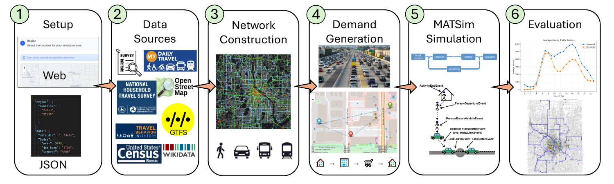
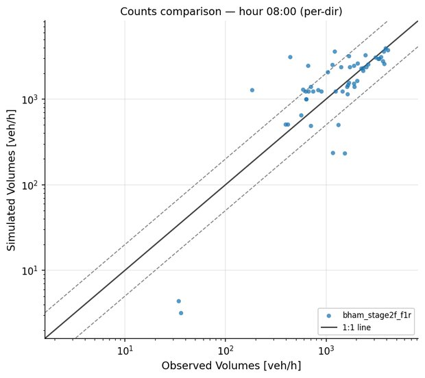
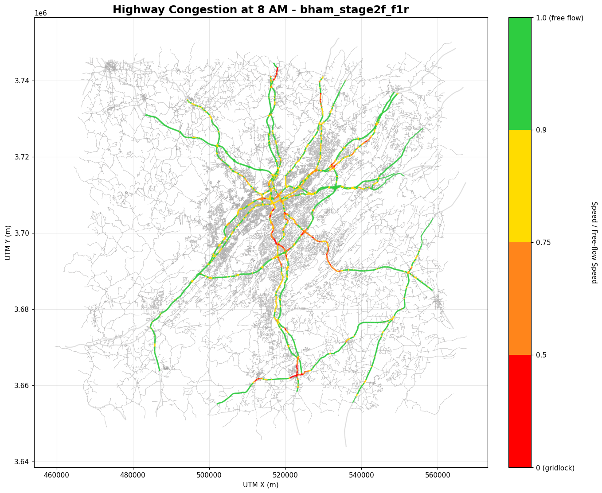
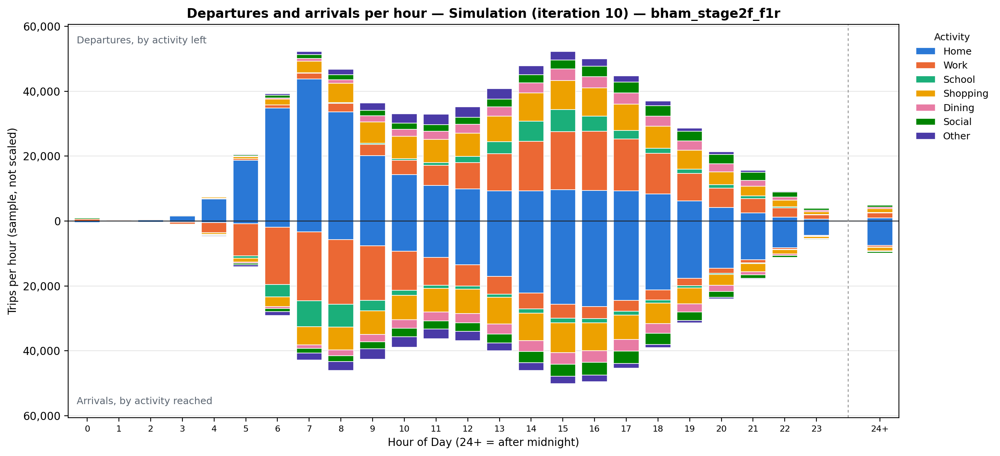
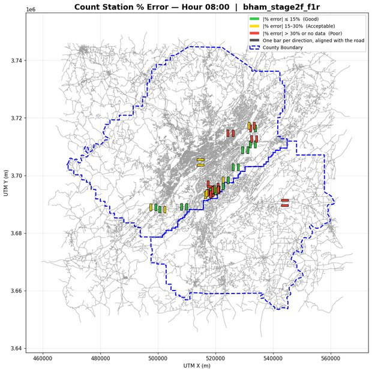
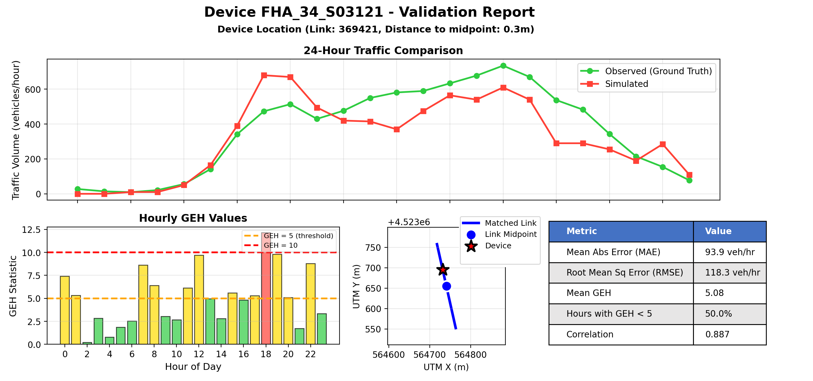
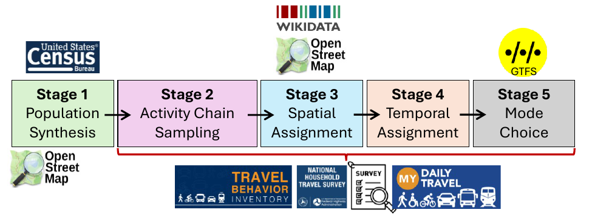
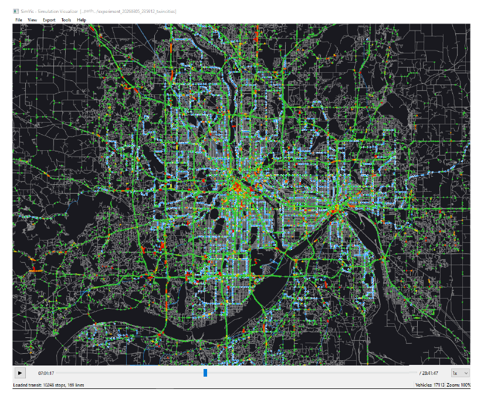
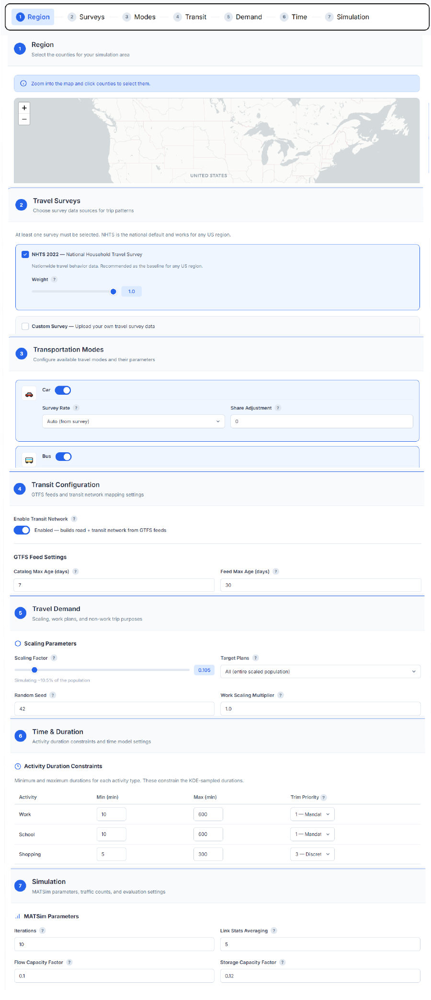

# TAREEK

**Build an agent-based traffic simulation for any U.S. region from a list of county codes.**

TAREEK (from Arabic *tarīq*, "road" or "path") is an open-source travel demand model for
[MATSim](https://matsim.org/). You give it a set of U.S. county FIPS codes. It then does
all the steps for you:

1. It downloads Census, employment, and road network data.
2. It finds and adds the transit feeds (GTFS) for the region.
3. It makes a synthetic population, with a full daily activity plan for each person.
4. It runs the MATSim simulation.
5. It compares the simulated traffic with national traffic count stations.

TAREEK uses only open data. You do not have to write code or prepare data by hand.



*The six stages of TAREEK: (1) you select the region in the web app or in a JSON file,
(2) TAREEK gets the data sources, (3) builds the road and transit network, (4) generates
the travel demand, (5) runs MATSim, and (6) validates the result against traffic counts.*

---

## What you can do with TAREEK

When you have a baseline simulation for a region, you can change its inputs and run it
again. Some research directions and practical problems that TAREEK can help with:

- **What-if studies on the road network.** Close a road, add a lane, or change the speed
  or capacity of a link, then measure the effect on travel times and traffic volumes.
- **Transit planning.** Test a new or extended transit line, or a change in service, and
  see how mode shares and traffic change.
- **Congestion and bottleneck analysis.** Find the links that are congested at each hour
  of the day, for example in the morning and evening peaks.
- **Compare regions.** Use the same method for a small city and for a large metropolitan
  area, and compare the results directly.
- **Regions without a local travel survey.** TAREEK uses the national survey (NHTS) by
  default, so you can model a region that has no survey of its own.
- **Travel demand research.** Study how activity chains, departure times, activity
  durations, and destination choice affect the simulated traffic.
- **Calibration and validation methods.** Test methods that tune the model automatically
  (for example optimization or AI agents) against the built-in count validation.
- **Model extensions.** Add freight, ride-hailing, or shared mobility, which the current
  pipeline does not generate.
- **Teaching.** Show students a complete agent-based simulation of their own city.

---

## Results

### What a TAREEK run gives you

Each run makes a full evaluation report. The figures below come from the
[Birmingham, AL example](examples/birmingham-jalal-20260925/) (2 counties, 25% population
sample, 10 MATSim iterations).

**Simulated vs. observed traffic at 8 AM.** Each point is one direction at one count
station. The x-axis is the observed volume and the y-axis is the simulated volume
(vehicles per hour, log scale). The solid line shows perfect agreement. The dashed lines
show 0.5× and 2× the observed volume. Most stations are between the dashed lines.

<p align="center">
  
</p>

**Highway congestion at 8 AM.** The color of each highway link shows the simulated speed
divided by the free-flow speed. Green is free flow. Red is near gridlock. You can see the
morning congestion on the roads into downtown Birmingham.



**Departures and arrivals per hour, by activity.** Bars above zero show the trips that
leave each activity. Bars below zero show the trips that arrive at each activity. You can
see the morning trips from home to work and school, and the afternoon trips back home.



**Count station error at 8 AM.** Each bar is one direction at one count station. Green
is an error of 15% or less, yellow is 15-30%, and red is more than 30%. Use this map to
find where the model is good and where it needs more work.



**Report for each count station.** For each station, TAREEK shows the location of the
matched road link, the observed and simulated volume for all 24 hours, and the hourly
GEH value with summary statistics (MAE, RMSE, correlation).



### How the travel demand is made



*Demand generation has five stages. Each stage uses a different open data source: Census
for the population, travel surveys for activity chains and times, OpenStreetMap and
Wikidata for locations, and GTFS for transit.*

### See the simulation with TAREEK-Vis

[TAREEK-Vis](https://github.com/jalal1/Tareek-vis) is an open-source desktop application
that replays the output of a TAREEK run on the road and transit network. You can watch
the vehicles move, click a vehicle to see the full day of its driver, and find the
congested links at each time of day. Download the Windows installer from the
[releases page](https://github.com/jalal1/Tareek-vis/releases).



*TAREEK-Vis replays a Twin Cities run at the morning peak. Green links have free-flow
traffic, red links are congested, and blue shows transit stops and lines.*

---

## Examples

The [examples folder](examples/) has complete runs for real regions: the config that was
used, the results, and a full `report.html` for each run. Now it has
[Birmingham, AL](examples/birmingham-jalal-20260925/) and
[Madison, WI](examples/madison-jalal-20260925/). We will add more cities.

You can also add your own region. See [examples/CONTRIBUTING.md](examples/CONTRIBUTING.md).

> GitHub does not show HTML pages. To see a `report.html`, download the file and open it
> in a web browser.

---

## Quick start

### 1. Prerequisites

- Python 3.12+
- Java 17+ (for MATSim)
- `osmium-tool` (necessary for network generation; see [docs/osm-tools-installation.md](docs/osm-tools-installation.md))

### 2. Setup

```bash
git clone https://github.com/jalal1/TAREEK.git
cd TAREEK

python -m venv .venv

# Windows
.venv\Scripts\activate

# Linux/macOS
source .venv/bin/activate

pip install -r requirements.txt
```

### 3. Configure

You can use `config/config_local.json` as it is. To model a different area, change the
`counties` field to the FIPS GEOIDs of your counties (2-digit state + 3-digit county).
You can find the codes at [census.gov](https://www.census.gov/library/reference/code-lists/ansi.html).
There are example configs for different cities in `config/USA/`.

You can also make a config in the web app. See [Config Wizard](#config-wizard-web-ui).

### 4. Run

```bash
python run_experiment.py --config config/config_local.json
```

Options:

| Flag | Description |
|---|---|
| `--config` | Path to config JSON (required) |
| `--experiment-id` | Custom experiment name (optional, auto-generated) |
| `--skip-simulation` | Generate plans only, do not run MATSim |

The output goes to `experiments/<experiment-id>/`.

### 5. Make the report

```bash
python scripts/experiment_report.py experiments/<experiment-id> --no-pdf
```

This makes one `report.html` file with all the figures and validation results.

---

## Config Wizard (web UI)

You do not have to edit the JSON by hand. The Config Wizard is a web interface that makes
a config file for any U.S. county. Select counties on a map, set the travel modes, the
transit feeds, the scaling factor, and the simulation settings, then export a
`config.json` that is ready to use.

[Watch the demo video](https://www.youtube.com/watch?v=Vlc4IO8HXN4)

```bash
cd webapp
python run.py
```

It opens at **http://localhost:8000**. See [webapp/README.md](webapp/README.md) for more
information.

<details>
<summary>Screenshot: the seven configuration stages</summary>



</details>

When the wizard makes your `config.json`, put it in the `config/` folder and run the
experiment from the command line:

```bash
python run_experiment.py --config config/config.json
```

> **Coming soon:** run simulations directly from the web app.

---

## More information

For the architecture, how to extend the system, and guidance for contributors, see the
[Technical Report](TECHNICAL_REPORT.md).

---

## Optional API keys

TAREEK runs without these keys. Without them, you can see warnings in the logs and some
data is missing (no ACS calibration, and some transit feeds are skipped). Both keys are
**free**:

| Key | Where to register | What it is for | Where to put it in `config.json` |
|---|---|---|---|
| Census API key | https://api.census.gov/data/key_signup.html | Gets ACS commute data (B08301, B08303) to calibrate mode shares | `data.census_api_key` |
| WMATA API key | https://developer.wmata.com/ | Authenticates GTFS downloads for feeds that need it (for example DC Metro) | `gtfs.api_keys["wmata.com"]` |

Replace the placeholder values (`YOUR_CENSUS_API_KEY_HERE`, `YOUR_WMATA_API_KEY`) in your
config file with your keys. You need the WMATA key only if your region uses a feed from
`wmata.com`. If other domains need keys, add them under `gtfs.api_keys` in the same way.

---

## License

Copyright (C) 2026 TAREEK Contributors

This program is free software; you can redistribute it and/or modify
it under the terms of the [GNU General Public License](LICENSE) as published by
the Free Software Foundation; either version 2 of the License, or
(at your option) any later version.
