# Madison, WI experiment — Jalal, 2026-09-25

A **cold-start** Tareek run for Dane County (Madison), compared against FHA directional
traffic counts. "Cold start" means no earlier run of this region was used for tuning:
the Tareek estimators made the starting values from public data (ACS commute shares,
transit density), and this run shows how far those values go without calibration.

- **Experiment ID:** `madison_cold_10iter`
- **Region:** 1 Wisconsin county — Dane (`55025`, Madison)
- **Scaling factor:** `0.25` (25% population sample) · **MATSim iterations:** 10 · **Mobsim:** `qsim`
- **Chain sampling:** `generated`
- **Runtime:** ~44 min total (MATSim 40 min, evaluation 3 min) on a 32-CPU server

> ⚠️ **Only 8 directional counts (4 physical stations)** are available in Dane County.
> The metrics below are much less certain than for a region with many stations. For
> example, one station changes "within ±10%" by 12.5 points. Do not compare them
> directly with examples that have many more counts, such as Birmingham (53 counts).

---

## Full report

**[`report.html`](report.html)** is the complete experiment report: the verdict, the
demand check against the household survey, the count validation, and all the
evaluation figures (hourly error maps, heatmaps, trip timing and more). It is one
self-contained file. All the images are inside it.

> **How to open it:** GitHub does not show HTML pages. Open
> [`report.html`](report.html) on GitHub, click **Download raw file**, then open the
> downloaded file in a web browser. Or clone the repository and open the file locally.

To make the same report for your own run:

```bash
python scripts/experiment_report.py experiments/<experiment-id> --no-pdf
```

---

## How to reproduce

This run used [`config_used.json`](config_used.json). To run it again, copy the config
into the `config/` folder and start it:

```bash
# from the repository root, with the virtualenv activated
cp examples/madison-jalal-20260925/config_used.json config/madison.json
python run_experiment.py --config config/madison.json
```

Before you start, change these values in the config for your machine:

| Field | Value in this run | Change to |
|-------|-------------------|-----------|
| `data.data_dir` | server path | the `data/` folder of your clone |
| `matsim.heap_size_gb` | 70 | less than your RAM |
| `plan_generation.num_processes` | 30 | your CPU count, or less |

**About the plans:** this run used the network, counts and `plans.xml` of an earlier
run that used the same estimated config (`skip_if_exists: true`, see `_reuse_note` in
the config). For this reason, the population and plan-generation fields in
[`experiment_summary.json`](experiment_summary.json) show 0, and the earlier run is no
longer available. A new run with this config makes the plans again from the start.

The values that the estimators set have an `_estimator_...` note next to them in the
config. The note gives the reason for each value.

Output goes to `experiments/<experiment-id>/`. The large files (`network.xml` ≈ 42 MB,
`plans.xml` ≈ 73 MB, the MATSim `output/` folder) are **not** in this folder.

For the setup steps, see the **[project README](../../README.md#quick-start)**. The two
API keys in the config are **optional** — see [Optional API keys](#optional-api-keys).

---

## Configuration

- [`config_used.json`](config_used.json) — the full Tareek config for this run
- [`config.xml`](config.xml) — the MATSim config that Tareek made
- [`counts.xml`](counts.xml) — the observed counts given to MATSim
- [`matched_devices.csv`](matched_devices.csv) — FHA count devices matched to network links
- [`experiment_summary.json`](experiment_summary.json) — the full machine-readable run summary
- [`experiment_20260925_003817.log`](experiment_20260925_003817.log) — the run log

### Key parameters

| Parameter | Value | Notes |
|-----------|-------|-------|
| `scaling_factor` (population) | **0.25** | 25% sample of the full population |
| MATSim iterations | **10** | |
| `flowCapacityFactor` | 0.25 | equal to the scaling factor |
| `storageCapacityFactor` | 0.30 | 1.2 × the flow factor |
| `stuckTime` | 10 s | the MATSim default; the same as the Birmingham example |
| `countsScaleFactor` | 4.0 | 1 / flowCapacityFactor |
| walk `constant` | −1.0 | estimator value (ACS walk share 5.2%) |
| bus `config_rate` / `blend_weight` | 0.08 / 0.5 | estimator value (ACS bus share 3.1%) |

### Scenario scale

| | |
|---|---|
| Agents simulated | 149,070 |
| Stuck agents | 122 |
| Network | 36,066 nodes · 81,752 links |
| Generated mode split (legs) | car 91.1% · walk 6.8% · pt 2.1% |

---

## Headline results

Simulated against observed link volumes at **4 physical count stations**
(8 directional counts, 192 station-hours).

| Metric | Value | Target | Status |
|--------|------:|--------|:------:|
| **Overall volume (sim/obs)** | **1.009** | 1.0 ± 0.10 | PASS |
| Volume level (interquartile mean) | 0.998 | 1.0 ± 0.10 | PASS |
| Per-station ratio CV | 0.314 | < 0.35 | PASS |
| Correlation (sim vs obs) | 0.959 | > 0.85 | PASS |
| % hourly counts with GEH < 5 | 42.2% | > 85% | CHECK |
| MAE / RMSE | 259 / 434 veh/h | | |

The daily level is correct. The hourly GEH is low because the time-of-day profile is
wrong: too many vehicles in the morning and evening peaks, and too few at midday and
at night.

### Time of day

| Block | Hours | Sim/Obs |
|-------|-------|--------:|
| Night | 0–3 | 0.26 |
| Morning | 4–9 | 1.21 |
| Midday | 10–17 | 0.87 |
| Evening | 18–23 | 1.21 |

### Demand against the survey (NHTS 2022)

| Quantity | Simulated | NHTS 2022 | Ratio |
|----------|----------:|----------:|------:|
| Trips per person per day | 2.90 | 2.82 | 1.03 |
| Median trip length (km, after the 1.25 network correction) | 4.66 | 6.93 | 0.67 |
| Car share | 91.6% | 87.4% | +4.3 pp |
| Transit share | 1.3% | 4.4% | −3.2 pp |

No local household travel survey is loaded for this region, so the reference is the
national survey.

### Where the error is

| | |
|---|---|
| 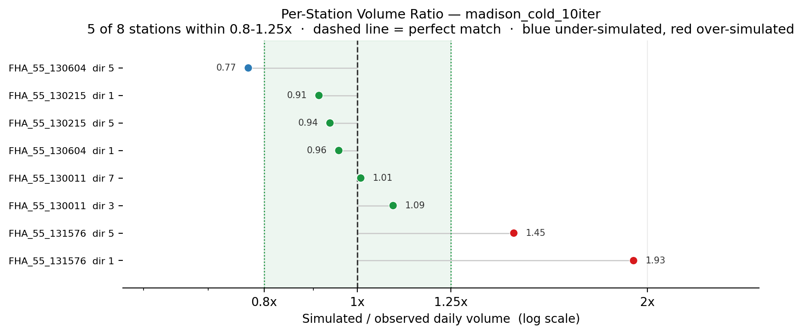 | 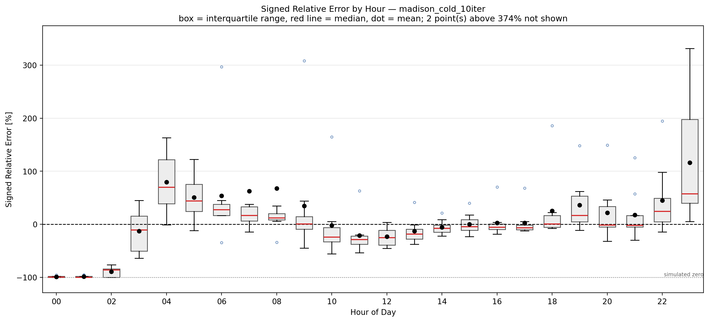 |
| Sim/obs ratio per station, sorted | Signed relative error per hour, all stations |

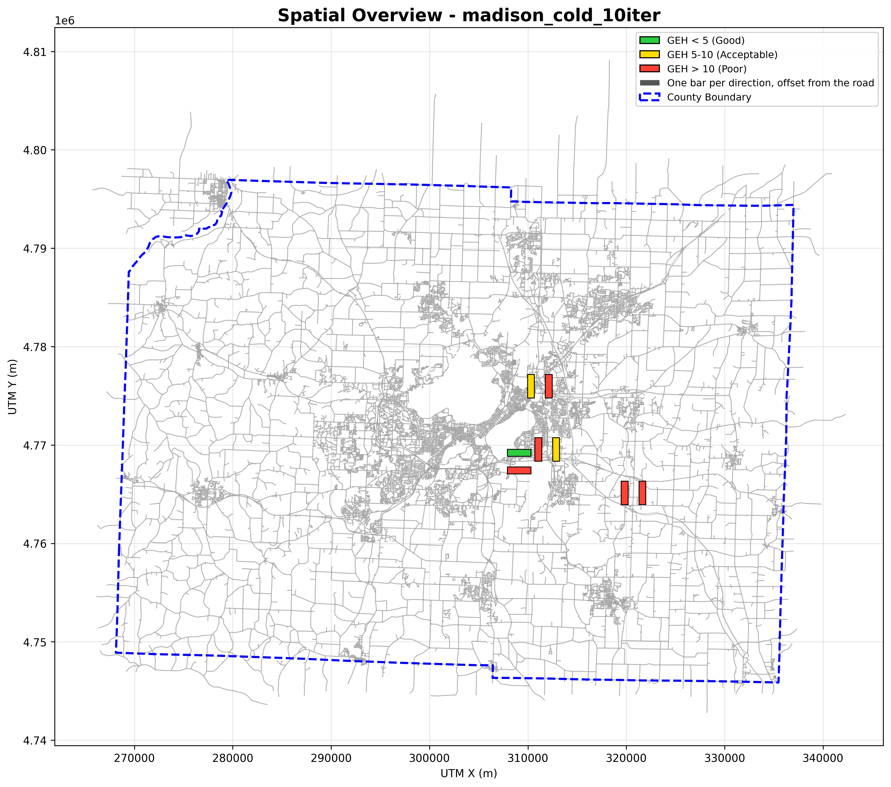

More figures are in [`evaluation/`](evaluation/). The full set, with captions, is in
[`report.html`](report.html).

Data: [`evaluation/volume_comparison.csv`](evaluation/volume_comparison.csv) (per hour,
per station) · [`evaluation/trip_timing_check.json`](evaluation/trip_timing_check.json)
· [`matsim_output/10.countscompare.txt`](matsim_output/10.countscompare.txt) (MATSim's
own count comparison) · [`matsim_output/`](matsim_output/) (mode and score statistics)

---

## MATSim count graphs

MATSim's own count graphs for iteration 10 are in [`graphs/`](graphs/). GitHub does not
show them. Download or clone the folder and open `graphs/start.html` in a browser.

---

## Per-device count reports

Observed and simulated hourly profiles for each of the 8 count directions
(`dir` = FHA direction code, `link` = matched network link). Click a thumbnail to see
it at full size.

<table>
<tr>
<td width="25%"><a href="evaluation/device_reports/device_FHA_55_130011_3_linkid_81215.png">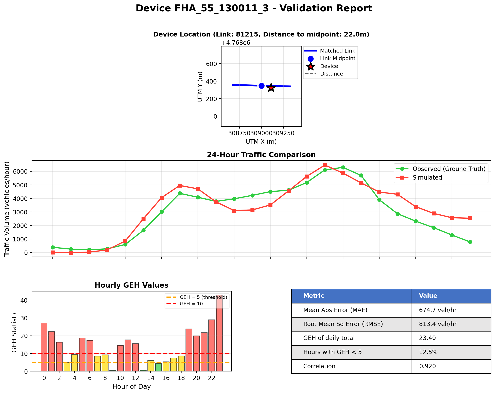</a><br><sub>WI 130011 dir3 (link 81215)</sub></td>
<td width="25%"><a href="evaluation/device_reports/device_FHA_55_130011_7_linkid_74729.png">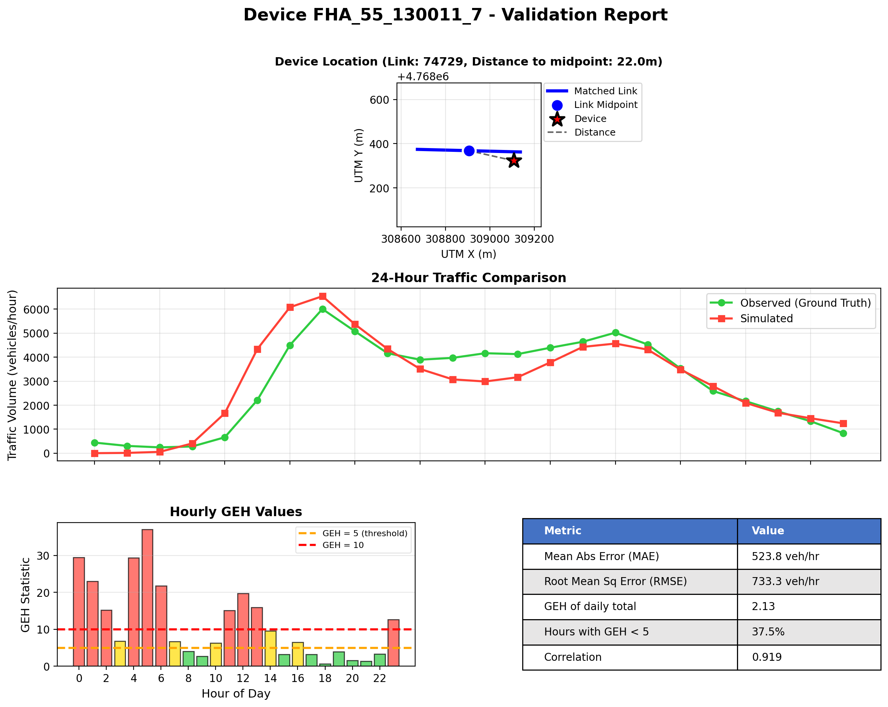</a><br><sub>WI 130011 dir7 (link 74729)</sub></td>
<td width="25%"><a href="evaluation/device_reports/device_FHA_55_130215_1_linkid_40760.png">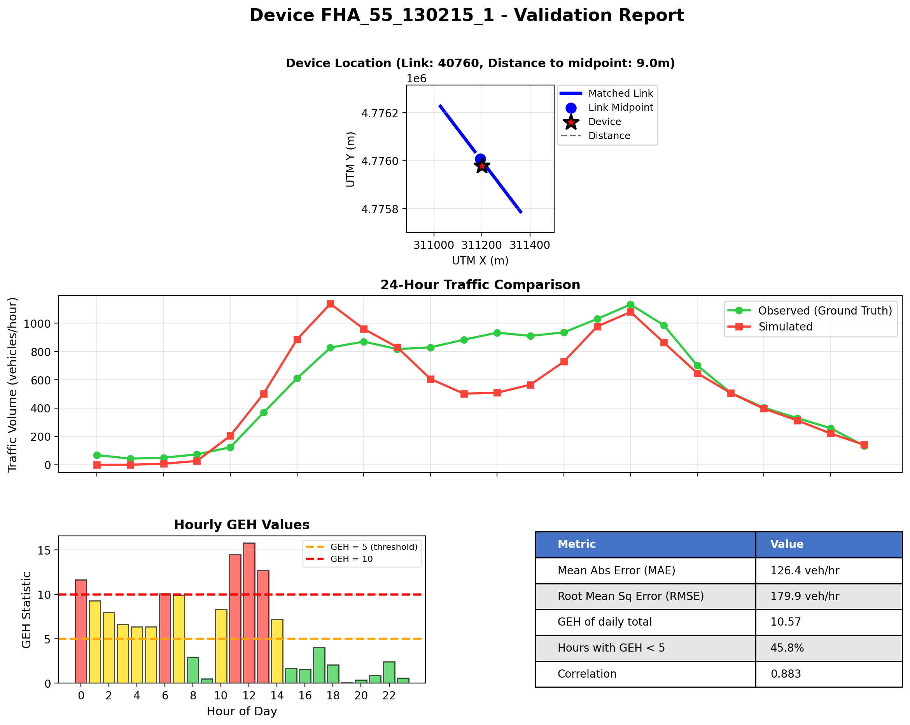</a><br><sub>WI 130215 dir1 (link 40760)</sub></td>
<td width="25%"><a href="evaluation/device_reports/device_FHA_55_130215_5_linkid_31990.png">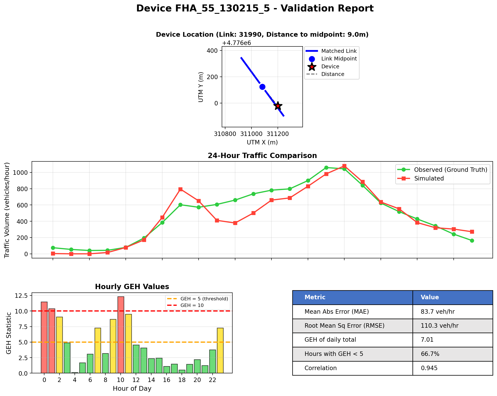</a><br><sub>WI 130215 dir5 (link 31990)</sub></td>
</tr>
<tr>
<td width="25%"><a href="evaluation/device_reports/device_FHA_55_130604_1_linkid_31984.png">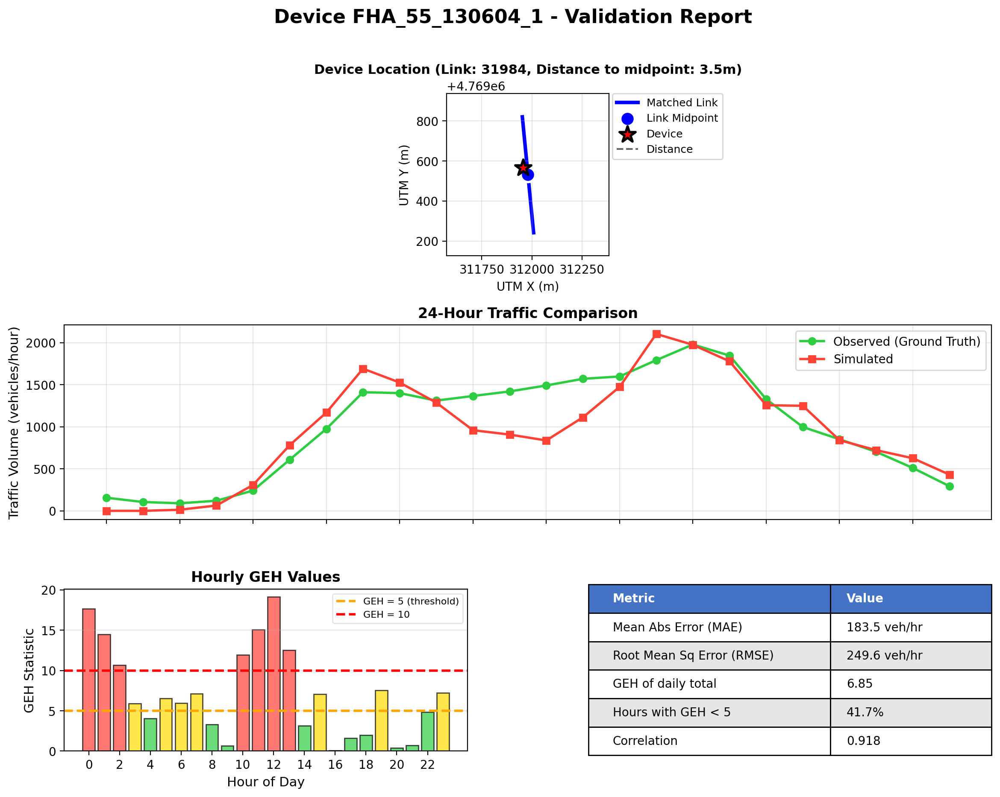</a><br><sub>WI 130604 dir1 (link 31984)</sub></td>
<td width="25%"><a href="evaluation/device_reports/device_FHA_55_130604_5_linkid_42243.png">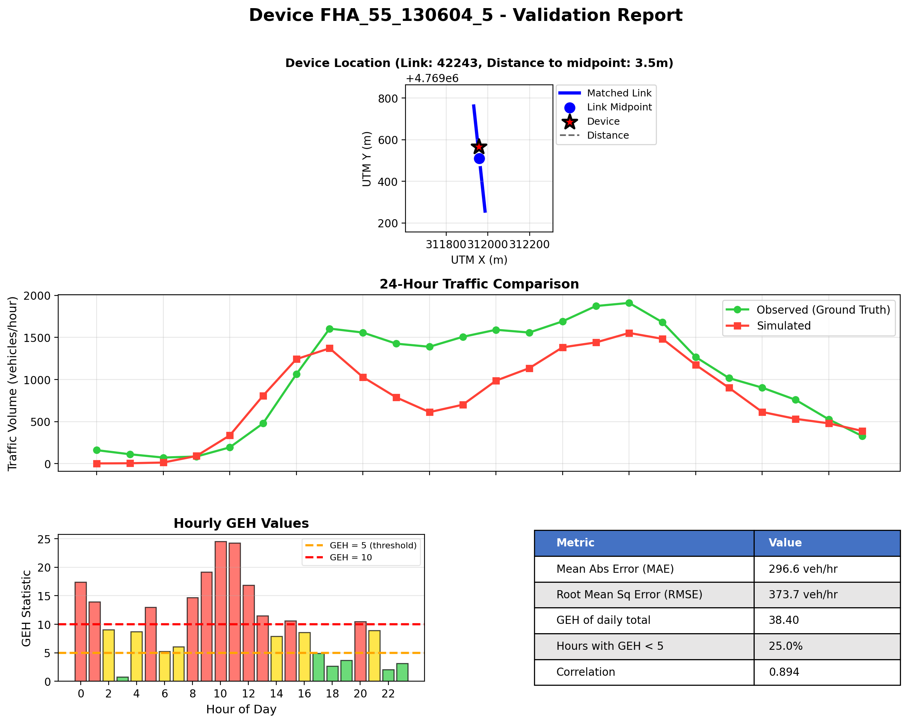</a><br><sub>WI 130604 dir5 (link 42243)</sub></td>
<td width="25%"><a href="evaluation/device_reports/device_FHA_55_131576_1_linkid_44151.png">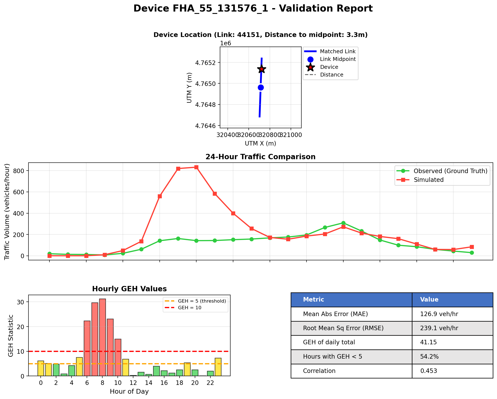</a><br><sub>WI 131576 dir1 (link 44151)</sub></td>
<td width="25%"><a href="evaluation/device_reports/device_FHA_55_131576_5_linkid_44152.png">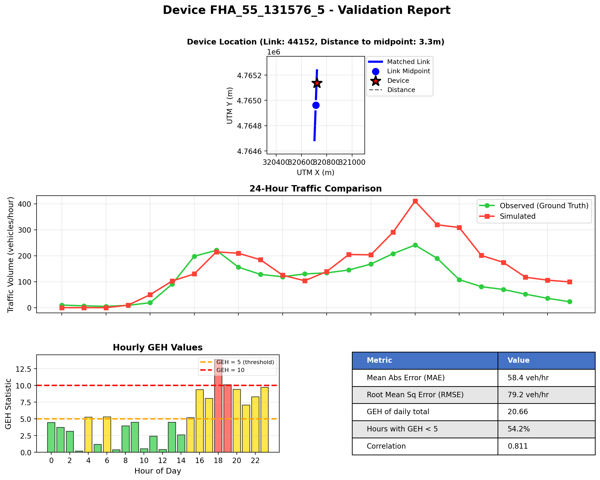</a><br><sub>WI 131576 dir5 (link 44152)</sub></td>
</tr>
</table>

---

## Optional API keys

`config_used.json` refers to two external services. The keys in this config are
**redacted** (`YOUR_..._KEY`). Both are free:

| Field in config | Service | Register (free) |
|-----------------|---------|-----------------|
| `data.census_api_key` | U.S. Census API — ACS commute data | https://api.census.gov/data/key_signup.html |
| `gtfs.api_keys["wmata.com"]` | WMATA GTFS feed | https://developer.wmata.com/ |

The Census key is **optional for this run**, but it is **necessary** to make a new
cold-start config with the estimators, because they read the ACS commute data. The
Census API now rejects requests without a valid key. **Never commit real keys.**
