# Madison, WI experiment — Jalal, 2026-09-28

A full Tareek run for Dane County (Madison), compared against FHA directional traffic
counts. It uses person-first demand, freight and the Hermes mobsim, in the same way as
the [Twin Cities example](../twincities-jalal-20260928/).

- **Experiment ID:** `madison_pf_hermes_w11_nw18_fr03_10iter`
- **Region:** 1 Wisconsin county — Dane (`55025`, Madison)
- **Scaling factor:** `0.25` (25% population sample) · **MATSim iterations:** 10 · **Mobsim:** `hermes`
- **Demand:** person-first, NHTS 2022 · **Knobs:** `work_scaling_multiplier` 1.1, `nonwork_trip_share` 1.8
- **Freight:** on, boundary trucks from HPMS, `demand_scale` 0.3
- **Runtime:** ~24 min total (plans 5 min, MATSim 15 min, evaluation 3 min) on a 32-CPU server

> ⚠️ **Only 10 directional counts (5 physical stations)** are available in Dane County
> for October 2024. The metrics below are much less certain than for a region with many
> stations. Do not compare them directly with examples that have many more counts, such
> as the Twin Cities (94 counts) or Birmingham (53 counts).

---

## Full report

**[`report.html`](report.html)** is the complete experiment report: the verdict, the
demand check against the household survey, the count validation, freight, and all the
evaluation figures. It is one self-contained file. All the images are inside it.

> **How to open it:** GitHub does not show HTML pages. Open
> [`report.html`](report.html) on GitHub, click **Download raw file**, then open the
> downloaded file in a web browser. Or clone the repository and open the file locally.

To make the same report for your own run:

```bash
python scripts/experiment_report.py experiments/<experiment-id> --no-pdf
```

---

## What is new in this run

This example replaces `madison_cold_10iter` (2026-09-25), a cold-start run with the old
demand. The changes:

| Change | Before | This run |
|--------|--------|----------|
| Demand | every job makes one commute per day | **person-first**: the NHTS person-days set who commutes (52.5% of workers on a weekday) and who travels |
| Demand knobs | neutral | `work_scaling_multiplier` **1.1**, `nonwork_trip_share` **1.8** |
| Freight | off | **on**, 5,500 boundary truck trips (`demand_scale` 0.3) |
| Mobsim | qsim | **hermes** (`hermes.endTime` 36:00:00) |
| Counts | 8 directional counts | **October 2024**, 10 directional counts |

The knob values come from a projection made on the generated plans, before MATSim: the
count ratio of each time block in an earlier run, multiplied by the planned car-km of
the new plans divided by the old. Person-first demand with neutral knobs gave 0.616
(`madison_pf_10iter`); non-work 1.5 gave 0.774; the projection for non-work 1.8 was
0.822, and MATSim gave 0.813.

---

## How to reproduce

This run used [`config_used.json`](config_used.json). To run it again, copy the config
into the `config/` folder and start it:

```bash
# from the repository root, with the virtualenv activated
cp examples/madison-jalal-20260928/config_used.json config/madison.json
python run_experiment.py --config config/madison.json
```

Before you start, change these values in the config for your machine:

| Field | Value in this run | Change to |
|-------|-------------------|-----------|
| `data.data_dir` | server path | the `data/` folder of your clone |
| `matsim.heap_size_gb` | 70 | less than your RAM |
| `plan_generation.num_processes` | 30 | your CPU count, or less |

Output goes to `experiments/<experiment-id>/`. The large files (`network.xml`,
`plans.xml`, the MATSim `output/` folder) are **not** in this folder. The run above
makes them again from the config. The first freight run downloads the HPMS road data
for the region; later runs use the cache in `data/hpms`.

For the setup steps, see the **[project README](../../README.md#quick-start)**. The API
keys in the config are **optional** — see [Optional API keys](#optional-api-keys).

---

## Configuration

- [`config_used.json`](config_used.json) — the full Tareek config for this run
- [`config.xml`](config.xml) — the MATSim config that Tareek made
- [`counts.xml`](counts.xml) — the observed counts given to MATSim
- [`matched_devices.csv`](matched_devices.csv) — FHA count devices matched to network links
- [`demand_budget.json`](demand_budget.json) — the person-first demand budget
- [`freight_summary.json`](freight_summary.json) — freight cordons, trip totals and checks
- [`od_matrix_diagnostics.json`](od_matrix_diagnostics.json) — checks on the work OD matrix
- [`experiment_summary.json`](experiment_summary.json) — the full machine-readable run summary
- [`experiment_20260928_165226.log`](experiment_20260928_165226.log) — the run log

### Key parameters

| Parameter | Value | Notes |
|-----------|-------|-------|
| `scaling_factor` (population) | **0.25** | 25% sample of the full population |
| MATSim iterations | **10** | innovation stops after iteration 8 |
| `controller.mobsim` | **hermes** | `hermes.endTime` 36:00:00 |
| `flowCapacityFactor` | 0.25 | equal to the scaling factor, copied to hermes |
| `storageCapacityFactor` | 0.30 | 1.2 × the flow factor, copied to hermes |
| `countsScaleFactor` | 4.0 | 1 / flowCapacityFactor |
| `work_scaling_multiplier` | **1.1** | calibration knob |
| `nonwork_trip_share` | **1.8** | calibration knob |
| `freight.demand_scale` | **0.3** | see [Freight](#freight) |
| `data.survey_months` | `regular` | Mar-May, Sep-Nov survey days |
| `counts.fha.month` | 10 | October 2024 counts |
| `chain_sampling_method` | `direct` | |
| `first_departure_source` | `first_of_day` | |
| `over_budget` | `resample` | |

### Scenario scale

| | |
|---|---|
| Total population (Dane County) | 561,335 |
| Agents simulated | 180,412 (60,442 work · 114,470 non-work · 5,500 freight) |
| Stuck agents | 54 |
| Network | 36,066 nodes · 81,752 links |
| Generated mode split (legs) | car 91.3% · walk 6.2% · pt 2.5% |

---

## Headline results

Simulated against observed link volumes at **5 physical count stations**
(10 directional counts, 240 station-hours). Values are MATSim's count comparison, the
average of iterations 1-10.

| Metric | Value | Target | Status |
|--------|------:|--------|:------:|
| **Overall volume (sim/obs)** | **0.813** | 1.0 ± 0.10 | CHECK |
| Volume level (interquartile mean) | 0.801 | 1.0 ± 0.10 | CHECK |
| Per-station ratio CV | 0.148 | < 0.35 | PASS |
| Correlation (sim vs obs) | 0.972 | > 0.85 | PASS |
| % hourly counts with GEH < 5 | 42.0% | > 85% | CHECK |
| MAE / RMSE | 245 / 399 veh/h | | |

Against the previous example (`madison_cold_10iter`: old demand, qsim, no freight):

| Metric | Previous example | This run |
|--------|-----------------:|---------:|
| Overall volume | **1.009** | 0.813 |
| Interquartile mean | **0.998** | 0.801 |
| Per-station CV | 0.314 | **0.148** |
| Correlation | 0.959 | **0.972** |
| GEH < 5 | 42.2% | 42.0% |

### Time of day

| Block | Hours | Previous example | This run |
|-------|-------|-----------------:|---------:|
| Night | 0–3 | — | 0.47 |
| Morning | 4–9 | 1.21 | **1.06** |
| Midday | 10–17 | 0.87 | 0.73 |
| Evening | 18–23 | 1.21 | 0.69 |

The spread between stations is half of the previous example, and the morning and evening
overshoots are gone. The total is lower, because the previous demand gave every job a
daily commute. Midday and evening are now low: the plans put too many departures in the
morning, which is a time-of-day shape problem, not a level problem.

**Final iteration.** At iteration 10 alone (from its events) the total is 0.90 and the
morning is 1.19, because the walk and pt plans made during innovation are dropped at
iteration 9.

### Demand against the survey (NHTS 2022)

| Quantity | Simulated | NHTS 2022 | Ratio |
|----------|----------:|----------:|------:|
| Trips per person per day | 2.81 | 2.82 | 1.00 |
| Median trip length (km, after the 1.25 network correction) | 2.74 | 6.93 | 0.39 |
| Car share | 92.1% | 87.4% | +4.7 pp |
| Transit share | 1.6% | 4.4% | −2.8 pp |

The trips per person is per simulated agent (travellers only). No local household travel
survey is loaded for this region, so the reference is the national survey.

### Freight

Measured from the events of iteration 10 on the count links
([`evaluation/freight_share_it10.txt`](evaluation/freight_share_it10.txt)):

| Block | Freight share of simulated volume | Ratio | Ratio without freight |
|-------|----------------------------------:|------:|----------------------:|
| Night | 33% | 0.50 | 0.34 |
| Morning | 3.1% | 1.19 | 1.15 |
| Midday | 4.5% | 0.81 | 0.77 |
| Evening | 4.9% | 0.74 | 0.70 |
| **All** | **4.3%** | **0.90** | **0.86** |

Freight is 3.8% of the observed volume. 36 of the 63 cordons have an observed HPMS
truck volume; the others are weighted by road capacity.

### Where the error is

| | |
|---|---|
| 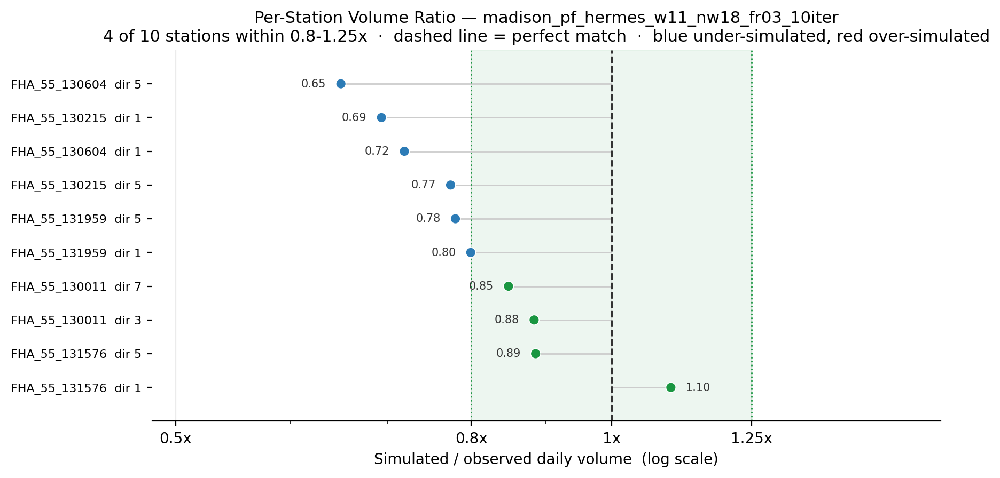 | 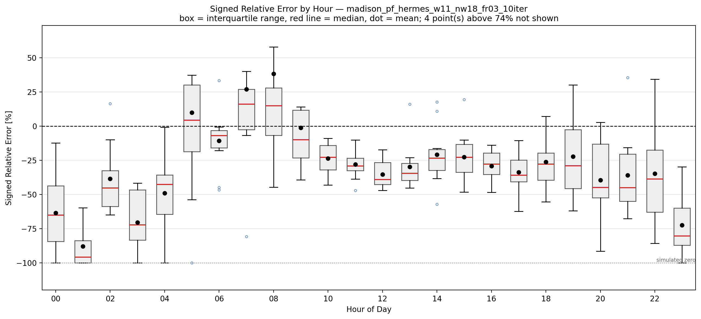 |
| Sim/obs ratio per station, sorted | Signed relative error per hour, all stations |

More figures are in [`evaluation/`](evaluation/). The full set, with captions, is in
[`report.html`](report.html).

Data: [`evaluation/volume_comparison.csv`](evaluation/volume_comparison.csv) (per hour,
per station) · [`evaluation/trip_timing_check.json`](evaluation/trip_timing_check.json)
· [`matsim_output/10.countscompare.txt`](matsim_output/10.countscompare.txt) (MATSim's
own count comparison) · [`matsim_output/`](matsim_output/) (mode and score statistics)

---

## MATSim count graphs

MATSim's own count graphs for iteration 10 are in [`graphs/`](graphs/). GitHub does not
show them. Download or clone the folder and open `graphs/start.html` in a browser.

---

## Per-device count reports

Observed and simulated hourly profiles for each matched count direction
(`dir` = FHA direction code, `link` = matched network link). Click a thumbnail to see
it at full size.

<table>
<tr>
<td width="25%"><a href="evaluation/device_reports/device_FHA_55_130011_3_linkid_81215.png">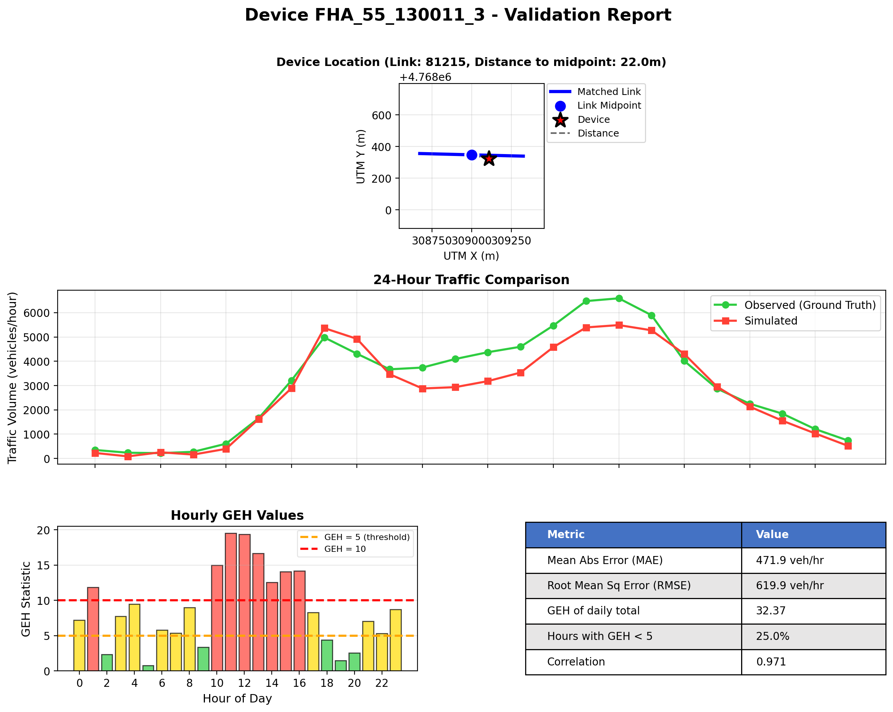</a><br><sub>WI 130011 dir3 (link 81215)</sub></td>
<td width="25%"><a href="evaluation/device_reports/device_FHA_55_130011_7_linkid_74729.png">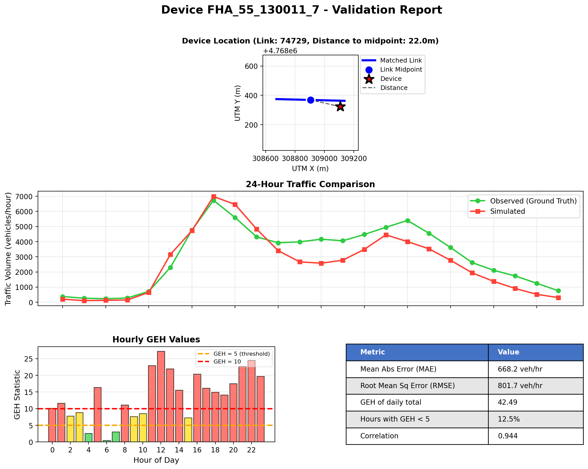</a><br><sub>WI 130011 dir7 (link 74729)</sub></td>
<td width="25%"><a href="evaluation/device_reports/device_FHA_55_130215_1_linkid_40760.png">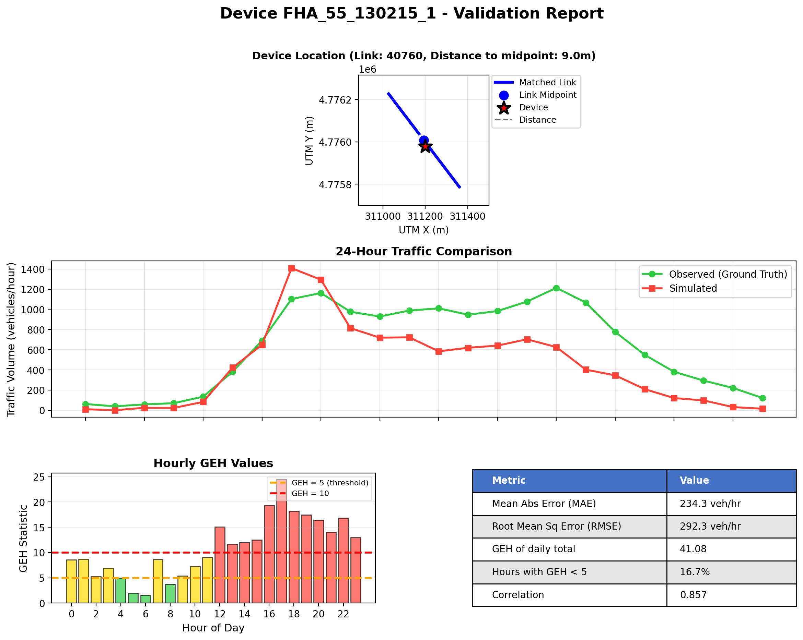</a><br><sub>WI 130215 dir1 (link 40760)</sub></td>
<td width="25%"><a href="evaluation/device_reports/device_FHA_55_130215_5_linkid_31990.png"></a><br><sub>WI 130215 dir5 (link 31990)</sub></td>
</tr>
<tr>
<td width="25%"><a href="evaluation/device_reports/device_FHA_55_130604_1_linkid_31984.png">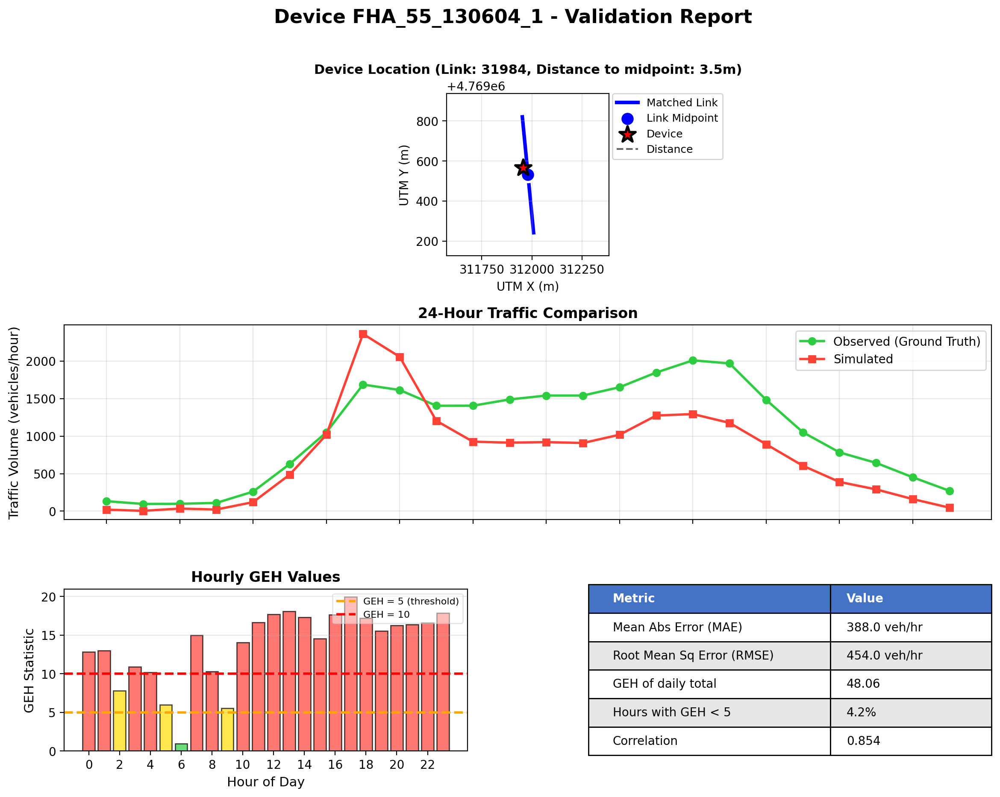</a><br><sub>WI 130604 dir1 (link 31984)</sub></td>
<td width="25%"><a href="evaluation/device_reports/device_FHA_55_130604_5_linkid_42243.png">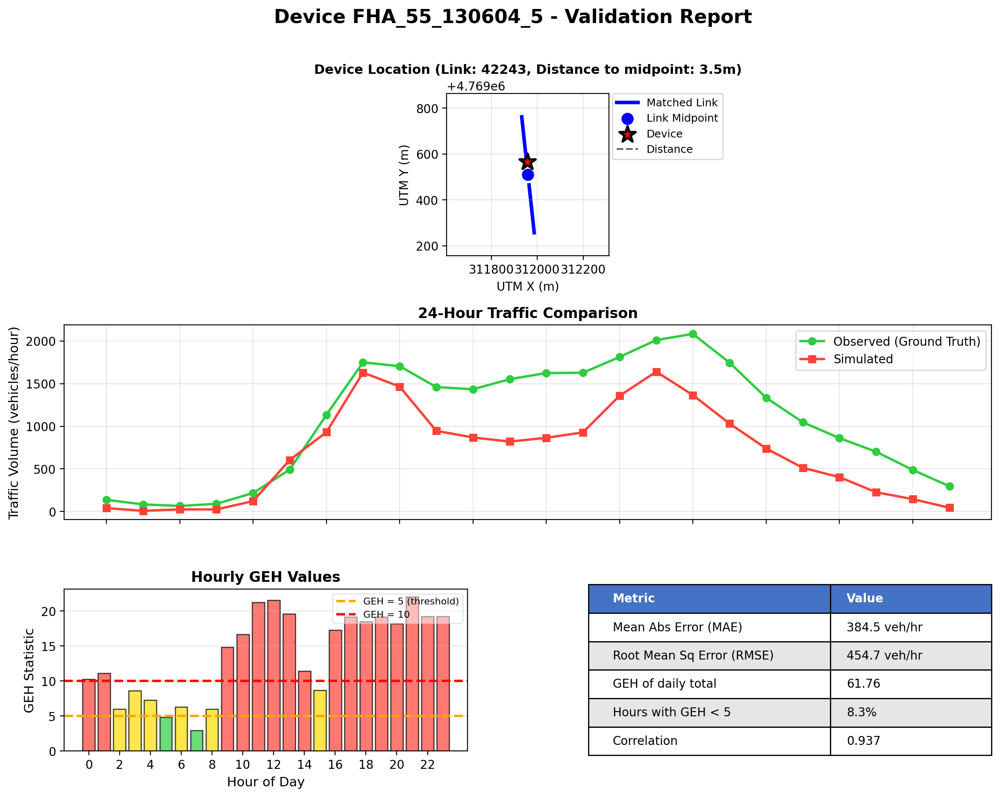</a><br><sub>WI 130604 dir5 (link 42243)</sub></td>
<td width="25%"><a href="evaluation/device_reports/device_FHA_55_131576_1_linkid_44151.png">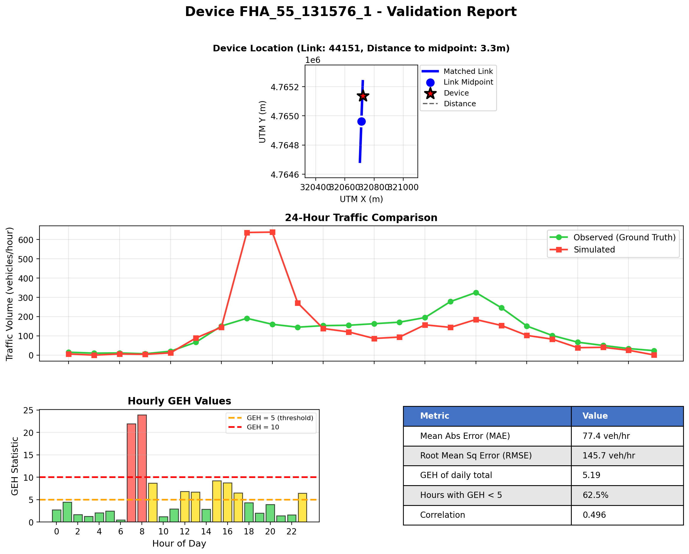</a><br><sub>WI 131576 dir1 (link 44151)</sub></td>
<td width="25%"><a href="evaluation/device_reports/device_FHA_55_131576_5_linkid_44152.png">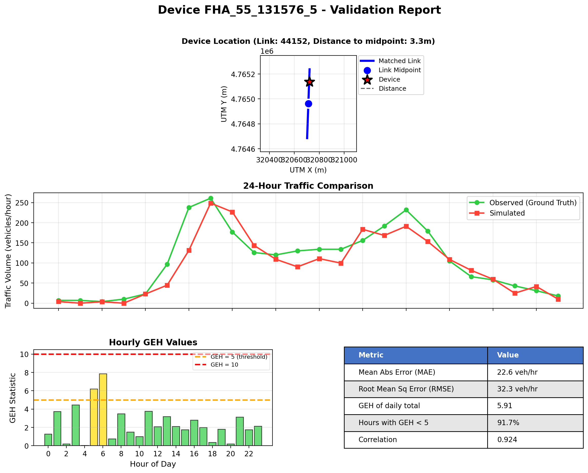</a><br><sub>WI 131576 dir5 (link 44152)</sub></td>
</tr>
<tr>
<td width="25%"><a href="evaluation/device_reports/device_FHA_55_131959_1_linkid_46429.png">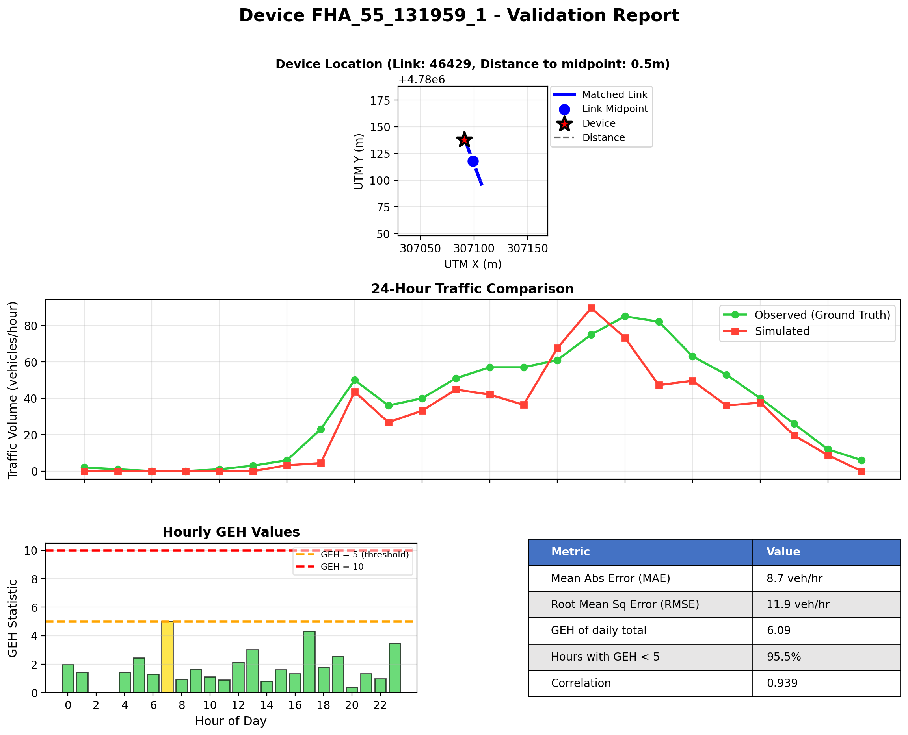</a><br><sub>WI 131959 dir1 (link 46429)</sub></td>
<td width="25%"><a href="evaluation/device_reports/device_FHA_55_131959_5_linkid_46430.png">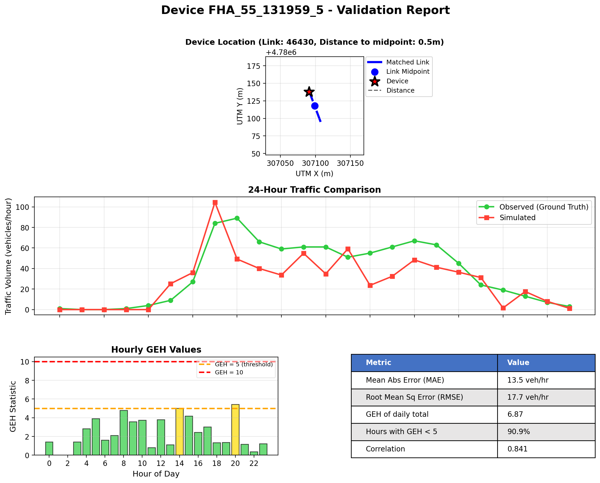</a><br><sub>WI 131959 dir5 (link 46430)</sub></td>
</tr>
</table>

---

## Optional API keys

`config_used.json` refers to two external services. They are **optional**. The pipeline
runs without them, with warnings and some missing data (no live ACS age split and
mode-share calibration, and no `wmata.com` transit feed). The keys in this config are
**redacted** (`YOUR_..._KEY`). Both are free:

| Field in config | Service | Register (free) |
|-----------------|---------|-----------------|
| `data.census_api_key` | U.S. Census API — ACS data | https://api.census.gov/data/key_signup.html |
| `gtfs.api_keys["wmata.com"]` | WMATA GTFS feed | https://developer.wmata.com/ |

The freight module reads the public HPMS service, which needs no key.

**Never commit real keys.**
